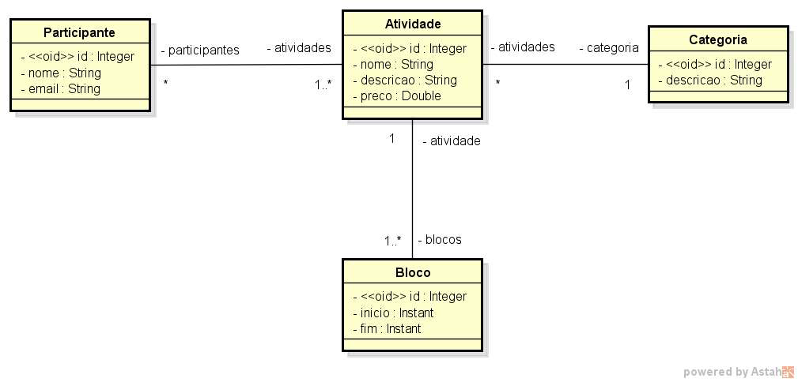
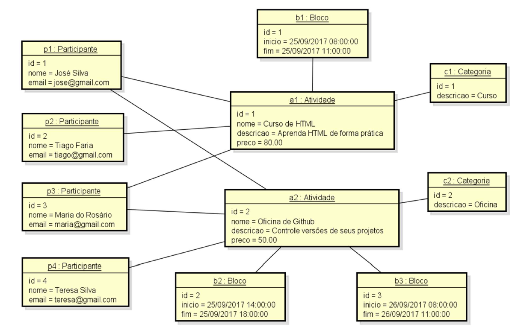

# Modelo de domínio e ORM

Neste projeto o desafio é criar uma implementação utilizando Spring Boot com Java e banco de dados H2 conforme o modelo conceitual apresentado no desafio.

## Especificacoes

Deseja-se construir um sistema para gerenciar as informações dos participantes das atividades de um
evento acadêmico. As atividades deste evento podem ser, por exemplo, palestras, cursos, oficinas
práticas, etc. Cada atividade que ocorre possui nome, descrição, preço, e pode ser dividida em vários
blocos de horários (por exemplo: um curso de HTML pode ocorrer em dois blocos, sendo necessário
armazenar o dia e os horários de início de fim do bloco daquele dia). Para cada participante, deseja-se
cadastrar seu nome e email.

### Instancias dos dados para seeding

Todos os direitos reservados ao [DevSuperior](https://devsuperior.club/)